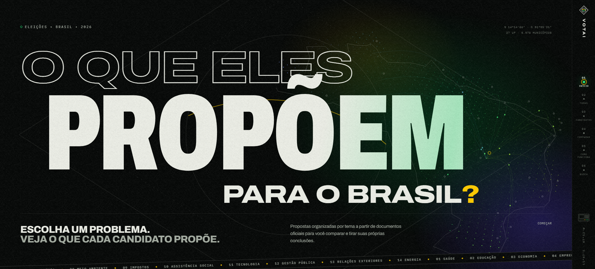

<p align="center">
  
</p>

<p align="center">
  
  
  
  
  
  
</p>

<p align="center">
  Plataforma web para consultar, organizar e comparar candidatos e propostas eleitorais
  usando os dados públicos do Tribunal Superior Eleitoral (TSE).
</p>

<!-- Se o site estiver publicado, descomente a linha abaixo e coloque o link -->
<!-- <p align="center"><a href="https://SEU-LINK-AQUI"><b>🔗 Acessar o VotAI</b></a></p> -->

---

## 🖥️ Preview

<!-- Envie um print da página inicial para assets/preview.png para esta imagem aparecer -->
<p align="center">
  
</p>

---

## 📌 Sobre o projeto

Em época de eleição, a informação sobre candidatos costuma estar espalhada e difícil de comparar.
O **VotAI** reúne esses dados em um só lugar e os apresenta de forma simples, para que o eleitor
consiga conhecer os candidatos, ler suas propostas e compará-las lado a lado antes de votar.

Este é um projeto pessoal, criado para colocar em prática desenvolvimento web back-end e front-end,
modelagem de banco de dados e tratamento de dados públicos.

---

## ✨ Funcionalidades

| Para o eleitor | Para o administrador |
| --- | --- |
| 🔎 Busca e filtros de candidatos | 🔐 Área administrativa |
| 👤 Página individual de cada candidato | 🗃️ Gestão dos dados no banco |
| 📄 Consulta de propostas eleitorais | 📝 Registro de atualizações e correções |
| 🗂️ Propostas organizadas por temas | |
| ⚖️ Comparação entre candidatos | |
| 🔗 Compartilhamento com prévia para redes sociais | |
| 📖 Páginas de metodologia, transparência e privacidade | |

---

## 🛠️ Tecnologias

- **Back-end:** PHP
- **Banco de dados:** MySQL
- **Front-end:** HTML5, CSS3 e JavaScript
- **Versionamento:** Git e GitHub

---

## 📂 Estrutura do projeto

```
VotAI/
├── admin/          # Área administrativa
├── api/            # Endpoints internos
├── assets/         # CSS, JS e imagens
├── database/       # Estrutura do banco de dados
├── includes/       # Arquivos reutilizados (cabeçalho, rodapé, conexão)
├── uploads/        # Arquivos enviados pelo painel
├── index.php       # Página inicial
├── candidatos.php  # Lista de candidatos
├── candidato.php   # Perfil do candidato
├── comparar.php    # Comparação entre candidatos
├── proposta.php    # Detalhe de uma proposta
├── temas.php       # Propostas por tema
└── busca.php       # Busca
```

---

## ⚙️ Como rodar localmente

1. Instale o [XAMPP](https://www.apachefriends.org/) (ou outro servidor com PHP e MySQL).
2. Clone o repositório dentro da pasta `htdocs`:
   ```bash
   git clone https://github.com/lorenzo-or7/VotAI.git
   ```
3. Crie um banco de dados no MySQL e importe o arquivo da pasta `database/`.
4. Configure os dados de conexão com o banco em `includes/`.
5. Acesse `http://localhost/VotAI` no navegador.

---

## 🗃️ Fonte dos dados

Os dados utilizados vêm do portal de dados abertos do **Tribunal Superior Eleitoral (TSE)**.
O VotAI é um projeto independente e **não possui vínculo oficial com o TSE**.

---

## 🤖 Uso de Inteligência Artificial

Ferramentas de IA foram usadas como apoio no desenvolvimento, em tarefas como programação,
resolução de problemas e melhorias de interface. A ideia, as decisões de estrutura e a
implementação do projeto foram conduzidas por mim.

---

## 👨‍💻 Autor

<p>
  Feito por <b>Lorenzo Orsetti</b><br/>
  <a href="https://www.linkedin.com/in/lorenzo-orsetti-031906349/">
    
  </a>
  <a href="https://github.com/lorenzo-or7">
    
  </a>
</p>

<p align="center">
  
</p>
